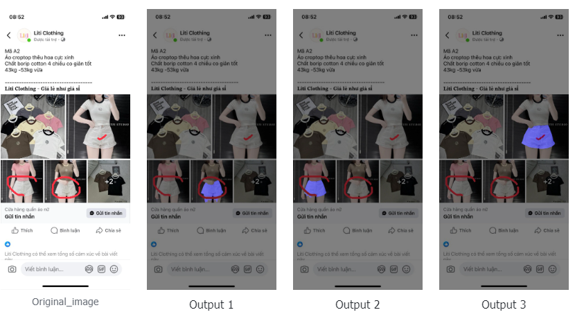
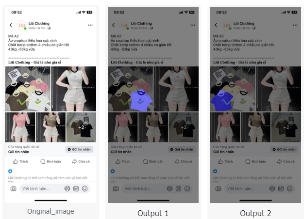

# extract_marked_object
## Description
"This project is developed to handle the detection of marker positions on objects (specifically clothing) for customers. The tool will detect and extract the segmentation of the object, which will assist in querying or extracting the features of the target object specified by the customer."

---

## Pipeline

- [ClipSeg](https://github.com/timojl/clipseg): The Clipseg model is a prompt-based segmentation model with CLIP as its backbone—a model renowned for its generalization capabilities, having been trained on a vast amount of information. Using a dataset of annotated objects (around 5k images), I experimented with several segmentation models and found that Clipseg performs quite well. If you have access to a large dataset, the pipeline can be streamlined to rely solely on Clipseg, where the output would be the segmentation of the selected object. However, since my dataset is limited and I require high segmentation accuracy, I only use Clipseg to detect the location of the annotated points..
- [Yolov11-seg](https://github.com/ultralytics): I used the YOLO model to classify different types of annotations, particularly arrow annotations, as this type of mask requires a different handling approach. Additionally, to use SAM2, we rely on point annotations. To prevent these point annotations from overlapping with user-made annotations—which could cause SAM2 to return the segmentation of the annotation itself—I used YOLO to accurately segment the annotations and then randomly select a point within the segmented area that does not overlap with the annotations.
- [SAM2](https://github.com/facebookresearch/sam2): 
After processing the annotations (tick marks, lines, circles, arrows, and other types), a point is returned. Using this point, we extract the segmentation from SAM2 and perform additional post-processing steps to select the most accurate mask when using multimask with SAM2.

---

## Demo
- 
- 

## Setup

Follow these steps to set up the project:

1. Finetune Clipseg to detect the user's annotation location on the image.
2. Train Yolov11 segment to classifcation and segmentation the user's annotation location on the image
3. Install lib follow SAM2, Clipseg and Yolo
